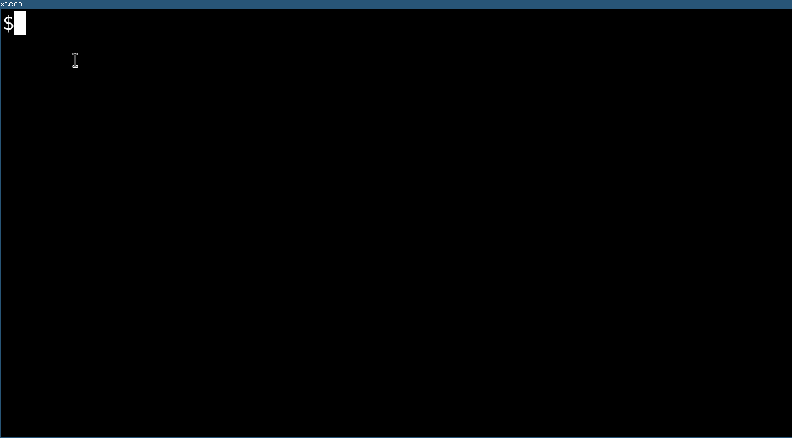

# circa
A Console RPN Interactive Calculator

Circa is a RPN calculator for the terminal that was made as the author couldn't get the dependencies for [orpie](https://github.com/pelzlpj/orpie) in all machines where he needed a calculator. In contrast to orpie it doesn't use curses, so the results of a calculation can be seen after program termination.

## Keys

Key        | Action
---------- | -------------
`0-9.`     | number
u          | undo
n          | negate
backspace  | backspace
`\`        | drop
enter      | add to stack
`+`        | add
`-`        | subtract
`*`        | multiply
`/`        | divide
`^`        | y^x
ctrl-d,esc | leave program
